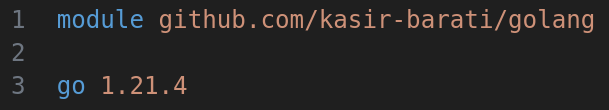

# Install Go

```cmd
# Manjaro linux
sudo pacman -Syu go
```

# Structure of Go Code

- Packages:
  - A bunch of go files :smile:.
- Modules:
  - A bunch of packages :smile:.
  - So basically when we initiate a new project we are creating a new module.

```cmd
go mod init github.com/kasir-barati/golang
```

> [!TIP]
>
> The name of module usually is the URL of a GitHub repository. But we can use any name we want, i.e. `git mod init test`.



Now you can start creating new packages:

```cmd
code src/utils/main.go
```

- This is a special package, it is the entry point of the program.
- It is where the compiler starts executing the code from.
- You must define a function called `main` in this package. **This is mandatory**.

Now it's time to build and run the program:

```cmd
go build src/utils/main.go
```

- This will create a binary file called `main` at the root of the project.
- I gitignore the output of this command.

Now let's run the program:

```cmd
./main
```

> [!TIP]
>
> You can also run the program with the `go run src/utils/main.go` command.

# Variables & Constants

- To declare a variable we use the `var` keyword.
- The type of the variable can be inferred from the value.
- We can also specify the type of the variable explicitly.

```go
var name string = "John"
```

> [!TIP]
>
> We must use every variable we define, otherwise the compiler will throw an error.

<table>
  <thead>
    <tr>
      <th colspan=5>Variable Types</th>
    </tr>
  </thead>
  <tbody>
    <tr>
      <td><code>int</code>, <code>uint</code></td>
      <td><code>int8</code>, <code>uint8</code></td>
      <td><code>int16</code>, <code>uint16</code></td>
      <td><code>int32</code>, <code>uint32</code></td>
      <td><code>int64</code>, <code>uint64</code></td>
    </tr>
    <tr>
      <td>-</td>
      <td>-</td>
      <td>-</td>
      <td><code>float32</code></td>
      <td><code>float64</code></td>
    </tr>
    <tr>
      <td><code>string</code></td>
      <td>-</td>
      <td>-</td>
      <td>-</td>
      <td>-</td>
    </tr>
    <tr>
      <td><code>rune</code></td>
      <td>-</td>
      <td>-</td>
      <td>-</td>
      <td>-</td>
    </tr>
    <tr>
      <td><code>bool</code></td>
      <td>-</td>
      <td>-</td>
      <td>-</td>
      <td>-</td>
    </tr>
  </tbody>
</table>

> [!TIP]
>
> **Overflow**:
>
> The size of the variable matters and in runtime you might run into the issue of overflow.
>
> ```go
> var score int16 = 32767
> score++
> println(score) // -32768
> var avg float32 = 999999.99
> fmt.Println(avg) // 1e+06
> ```

> [!NOTE]
>
> **`len` VS `utf8.RuneCountInString`**:
>
> `len` of a string is the number of bytes, **NOT** the number of characters!
>
> ```go
> var name string = "Öl"
> println(len(name)) // 3
> ```
>
> To get the number of characters we can use the `utf8` package.
>
> ```go
> import "unicode/utf8"
> var name string = "Öl"
> println(utf8.RuneCountInString(name)) // 2
> ```

- We can use the `int` type which picks `int23` or `int64` based on the system architecture.
- Int division is always an integer.
- `rune`s are equivalent of `char` types in c++.
- The default value of a variable depends on its type, e.g. `int` is `0`, `string` is `""`, etc.
- We can use the `:=` operator to declare and initialize a variable in one line, e.g. `name := "Mahdi"`.
  - Sometimes it is better to be as explicit as possible, `res := someFunc()`.

> [!NOTE]
>
> `const` is immutable & they must be initialized at declaration.
